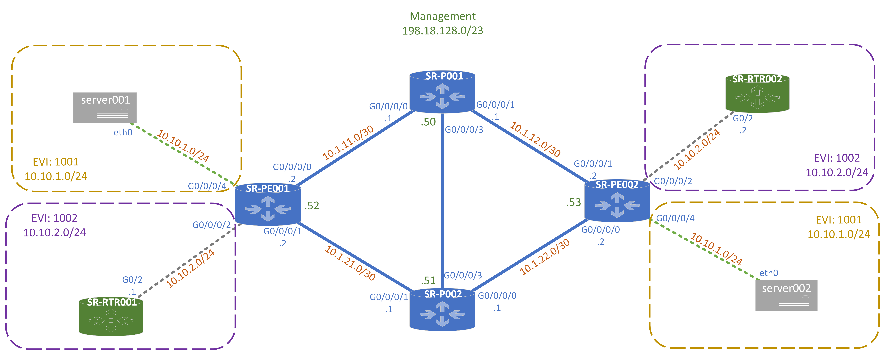
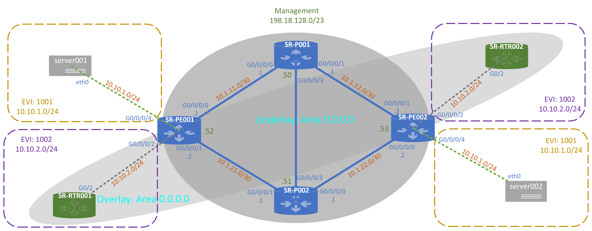

# SR-MPLS 101 
# Introduction 

<b>Welcome to SR-MPLS 101 </b>

This lab was created to provide a *minimal* approach to learning segment routing and some of the foudational concepts around it. 

In this lab you will learn how to configure a four-node transport network with an SR-MPLS with MP-BGP in support of L2 EVPN overlay services.  Along the way you will also verify and troubleshoot your lab network so that you can better operate the SR-MPLS network and L2 EVPN services for Day 2 operations.

> [!NOTE]
> The lab is built on Cisco Modeling Labs and you will be given access to the lab’s GUI.  Within the GUI you will be able to investigate packets as they traverse the network using the packet capture feature.  This will help with understanding the outcome of your changes to the network. 

# Task Summary 
The lab is built with structured tasks so that you may build the completed segment routed network. 

[Task 1 - OSPF Underlay ](task1/task1.md)   
[Task 1a - ISIS Underlay ](task1a/task1a.md) *optional underlay*   
[Task 2 - MP-BGP  ](task2/task2.md)   
[Task 3 - EVPN Services ](task3/task3.md)   
[Task 4 - Service VPN - OSPF routing ](task4/task4.md)  

> [!NOTE]
> BONUS! [Task 5 - SR Traffic Engineering ](task5/task5.md)   

 
# The Topology 
The network consists of four XR9kv nodes that have a base set of configuration applied.  However, there are no routing protocols or other services configured on any of the nodes in the network. It is your job to properly configure the routing protocol (OSPF) and Multiprotocol BGP(MP-BGP). After the underlay is configured, you may configure a L2VPN service between two nodes that are directly connected to the XRv routers that are acting as Provider Edge (PE) routers.  You may test the service by pinging from one node to the other with the test nodes provided.

## Physical 

## Logical 

# Lab Details 
There is my lab. There are many like it, but this one is mine...

Your lab is yours and yours alone, so all resources are dedicated per-person. IP addresses and login credentials are as follows:   

Device      |  Address              | Username  | Password      | Type  
----------  | :------------         | :--------:| ----------:   | ----------:
sr-p001     | 198.19.128.50         | admin     |   cisco       | xr9kv
sr-p002     | 198.19.128.51         | admin     |   cisco       | xr9kv
sr-pe001    | 198.19.128.52         | admin     |   cisco       | xr9kv
sr-pe002    | 198.19.128.53         | admin     |   cisco       | xr9kv
sr-rtr001   | 198.18.128.60         | admin     |   cisco       | IOSv
sr-rtr002   | 198.18.128.61         | admin     |   cisco       | IOSv
server001   | 198.18.128.70         | admin     |   cisco       | Linux
server002   | 198.18.128.71         | admin     |   cisco       | Linux
cml001      | https://198.18.128.100| admin     |   cisco123!   | CML node
webrdp      | 198.18.133.11         | root      |   C1sco12345  | xr9kv

## Lab Connectivity 
### Remote Access VPN

 Expand VPN Details  
<pre><code>
If you chose to connect to the lab with remote access VPN you will need to SSH into the devices from your workstation. The workstation is pre-configured with PuTTY and the IP addresses for each device for ease of access. 

<b> VPN Endpoint: </b> https://dcloud-rtp-anyconnect.cisco.com
<b> Credentails: </b> located on your workstation in vpn-credentails.txt 
</pre></code>
   

### Remote Desktop 

 Expand RDP Details  
<pre><code>
If you chose to connect to the lab with  RDP/WebRDP you will be using a virtual machine to do so. The virtual machines is pre-configured with PuTTY and the IP addresses for each device for ease of access.
 
<b> WebRDP VM: </b> 198.18.133.11

</pre></code>
   

# Get Going! 
Now that you have a handle on the lab details and connectivity requirements its time to start working on your [Tasks](#Task-Summary)
