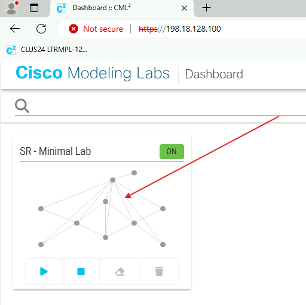

# Configure EVPN Services 

Some key terms for this task:
```angular2html
Attachment Circuit (AC): egress point of a router facing the Customer Edge (CPE) device
VPWS: Virtual Private Wire Service.  This is a point to point Layer 2 circuit
EVI:  EVPN Virtual Identifier.  This is the unique global identifier for an EVPN service
```
Both PE nodes in this network have two endpoints connected to them.  One endpoint type is a linux server, the other is an IOS-XE L3 switch.  Both linux servers need to talk to each other, and both switches need to talk to each other, but the linux hosts cannot talk to the switches.

To complete this Task, we need to create an AC for each device and an EVPN between the linux hosts and another between the switches.  We will also need to verify the underlay and the overlay is working correctly.

CPE <--> PE information:

```angular2html
server001 eth0 <--> sr-pe001 Gi0/0/0/4
server002 eth0 <--> sr-pe002 Gi0/0/0/4
sr-rtr001 Gi0/2 <--> sr-pe001 Gi0/0/0/2
sr-rtr002 Gi0/2 <--> sr-pe002 Gi0/0/0/2
```

Linux server circuit information:
```angular2html
EVI: 1001
sr-pe001 AC: 11001
sr-pe002 AC: 21001
Vlan: untagged
```
## Step 1: Configure Attachment Circuits on PE nodes

IOS-XR must have its interfaces configured as ‘l2transport’ before it will recognize strictly L2 traffic on a subinterface. After a subinterface is designated as an L2
interface, it will understand that it must match the dot1q tag specified in its configuration in order to know which subinterface to pin traffic to. That subinterface is later assigned to a L2VPN service, thus stitching a tagged or untagged subinterface to a L2 service.

On nodes sr-pe001 and sr-pe002, configure gi0/0/0/4.1 as an L2 subinterface, accepting untagged traffic, and no-shut the interface and its parent interface, gi0/0/0/4.

```bash
conf
int gi0/0/0/4
no shut
exit
int gi0/0/0/4.1 l2transport
encapsulation untagged
no shut
commit
```

## Step 2: Create EVPN Circuits on the PE Nodes

Now that the PE routers will know which ingress traffic will belong to this service, we can create the EVPN VPWS service itself. We will use xconnects to create the service. To complete this, we need a name for the xconnect group, and a name for the actual point-to-point circuit. These names are arbitrary, but should be useful to you, the engineer. Here, we will use group name ‘servers’ and p2p name ‘UNTAGGED’.

On both PE nodes sr-pe001 and sr-pe002:
```bash
l2vpn
xconnect group servers
p2p UNTAGGED
int gi0/0/0/4.1
```

Perform the following on sr-pe001:

```bash
neighbor evpn evi 1001 target 21001 source 11001
commit
end
```

Perform the following on sr-pe002:

```bash
neighbor evpn evi 1001 target 11001 source 21001
commit
end
```

## Step 3: Verify the overlay

At this time we should have a fully functional psuedowire between the two servers. To verify, log into the servers’ cli via putty, password is ‘cisco’ without the quotes. On server001, verify the local ip address, ping server002, and vice versa.

```bash
ip address show dev eth0
```
You should have output similar to below, verifying eth0's network facing the PE:

```angular2html
2: eth0: <BROADCAST,MULTICAST,UP,LOWER_UP> mtu 1500 qdisc pfifo_fast state UP qlen 1000
link/ether 52:54:00:1e:ec:94 brd ff:ff:ff:ff:ff:ff inet 10.10.1.1/24 scope global eth0
valid_lft forever preferred_lft forever
inet6 fe80::5054:ff:fe1e:ec94/64 scope link
valid_lft forever preferred_lft forever
```
Ping the server002's eth0 interface:

```angular2html
server001:~$ ping 10.10.1.2
```
Repeat for server002:

```bash
ip address show dev eth0
```
```angular2html
2: eth0: <BROADCAST,MULTICAST,UP,LOWER_UP> mtu 1500 qdisc pfifo_fast state UP qlen 1000
link/ether 52:54:00:14:7e:9d brd ff:ff:ff:ff:ff:ff inet 10.10.1.2/24 scope global eth0
valid_lft forever preferred_lft forever
inet6 fe80::5054:ff:fe14:7e9d/64 scope link
valid_lft forever preferred_lft forever

server002:~$ ping 10.10.1.1
PING 10.10.1.1 (10.10.1.1): 56 data bytes
64 bytes from 10.10.1.1: seq=0 ttl=42 time=2.775 ms
64 bytes from 10.10.1.1: seq=1 ttl=42 time=2.786 ms
```
## Step 3: Verify the underlay--BGP

BGP advertises the PE endpoints of each circuit and also the service label associated with the circuit on each PE. The service label is dynamic and may differ from what you see in the output below.
On sr-pe001:
```bash
show bgp l2vpn evpn
```
```angular2html
<snip>
Status codes: s suppressed, d damped, h history, * valid, > best
i - internal, r RIB-failure, S stale, N Nexthop-discard
Origin codes: i - IGP, e - EGP, ? - incomplete
Network                                     Next Hop Metric LocPrf Weight Path
Route Distinguisher: 3.3.3.3:1001 (default for vrf VPWS:1001) 
*> [1][0000.0000.0000.0000.0000][11001]/120 0.0.0.0                 0       i 
*>i[1][0000.0000.0000.0000.0000][21001]/120 4.4.4.4         100     0       i
Route Distinguisher: 4.4.4.4:1001
*>i[1][0000.0000.0000.0000.0000][21001]/120 4.4.4.4         100     0       i
```

Let's dissect this:
```angular2html
Route Distinguisher: 3.3.3.3:1001 (default for vrf VPWS:1001)
```
This is the circuit's Route Distinguisher on the local router.  The RD is 3.3.3.3:1001 which is broken down into the local router's BGP router-id : circuit EVI number.  This is how we identify the VPN and the PE node.
```angular2html
*> [1][0000.0000.0000.0000.0000][11001]/120 0.0.0.0                 0       i 
*>i[1][0000.0000.0000.0000.0000][21001]/120 4.4.4.4         100     0       i
```
These are the 'routes' for this VPN.  Broken down, we see 
* [1]: BGP EVPN route type 1.  Route Type 1 is always used for VPWS circuits
* [0000.0000.0000.0000.0000]: Ethernet Segment Identifier for the PE's AC. VPWS is a singular point to point, so there is only one AC per PE.  Hence, all zeros's.
* [11001] and [21001]: source and target AC identifiers for each PE
* /120: the bit mask of the route

The next hop for each 'route' is listed as 0.0.0.0 (local router) and 4.4.4.4 (remote PE node).  The router is smart enough to not route packets that have been sourced on the local AC back to itself, so it will forward all ingress packets to the next hop, 4.4.4.4.

The RD 4.4.4.4:1001 and its associated routes is what is learned from the remote PE, sr-pe002.

BGP also advertises the service labels for each circuit. Traditionally this was done by LDP. To see the labels that are advertised, run the following command on each PE node:

```bash
show bgp l2vpn evpn labels
```

Your output should be similar to this:
```angular2html
<snip>
Status codes: s suppressed, d damped, h history, * valid, > best
i - internal, r RIB-failure, S stale, N Nexthop-discard
Origin codes: i - IGP, e - EGP, ? - incomplete
Network                                     Next Hop Rcvd Label Local Label
Route Distinguisher: 3.3.3.3:1001 (default for vrf VPWS:1001)
*> [1][0000.0000.0000.0000.0000][11001]/120  0.0.0.0     nolabel     nolabel
*>i[1][0000.0000.0000.0000.0000][21001]/120  4.4.4.4     24004       nolabel
Route Distinguisher: 4.4.4.4:1001
*>i[1][0000.0000.0000.0000.0000][21001]/120  4.4.4.4     24004       nolabel
Processed 3 prefixes, 3 paths
```
RD 3.3.3.3:1001 has two routes, one with destination of the local router (its outbound advertisement to neighbors) and one with destination remote PE router 4.4.4.4.  The local router doesnt have a label from the local router's perspective.  This is why there is no label for the local route.  However, we see the service label of 24004 advertised from remote node 4.4.4.4.  Any SR-MPLS packets forwarded from the local router to node 4.4.4.4 for this service will have label 24004 pushed onto the bottom of its label stack.

## Step 4: Verify the underlay--MPLS Forwarding
# Need to rewrite the section regarding the local label table.
As mentioned earlier, SR Prefix (and other) labels are stored in the IGP.  We can lookup a service's destination prefix label in OSPF.  Do that on sr-pe001:

```bash
show ospf sid-database
```
You should output similar to this:
```angular2html
SID Database for ospf 1 with ID 3.3.3.3
SID Prefix/Mask
-------- ------------------
1   1.1.1.1/32
2   2.2.2.2/32
3   3.3.3.3/32 (L)
4   4.4.4.4/32
```
Because we know our global sid database range starts at 16000, we can deduce that the prefix-sid for prefix 4.4.4.4/32 is 16004.  Index 3 is the label for the local router's prefix, 3.3.3.3/32, as denoted by the '(L)'.

We know the remote label was learned via BGP.  We can discover the label assigned for the service by the local router by reviewing the MPLS forwarding table. On node <b>sr-pe001</b>:

```bash
show mpls forwarding
```
This gives us output similar to this:
```angular2html
Local Outgoing Prefix Outgoing Next Hop Bytes
Label Label or ID Interface Switched
------ ----------- ------------------ ------------ --------------- ------------
16001 Pop       SR Pfx (idx 1) Gi0/0/0/0 10.1.11.1 100076
      16001     SR Pfx (idx 1) Gi0/0/0/1 10.1.21.1 0 (!)
16002 Pop       SR Pfx (idx 2) Gi0/0/0/1 10.1.21.1 0
      16002     SR Pfx (idx 2) Gi0/0/0/0 10.1.11.1 0 (!) 
16004 16004     SR Pfx (idx 4) Gi0/0/0/0 10.1.11.1 0
      16004     SR Pfx (idx 4) Gi0/0/0/1 10.1.21.1 37826
24000 Pop       SR Adj (idx 0) Gi0/0/0/0 10.1.11.1 0
24001 Pop       SR Adj (idx 0) Gi0/0/0/0 10.1.11.1 0
      16001     SR Adj (idx 0) Gi0/0/0/1 10.1.21.1 0 (!)
24002 Pop       SR Adj (idx 0) Gi0/0/0/1 10.1.21.1 0
24003 Pop       SR Adj (idx 0) Gi0/0/0/1 10.1.21.1 0
      16002     SR Adj (idx 0) Gi0/0/0/0 10.1.11.1 0 (!) 
24004 Pop       PW(EVI=1001 AC-ID=21001) Gi0/0/0/4.1 point2point 36344
```
Let's focus on two sections of this output.
```angular2html
16004 16004     SR Pfx (idx 4) Gi0/0/0/0 10.1.11.1 0
      16004     SR Pfx (idx 4) Gi0/0/0/1 10.1.21.1 37826
```
This is showing us that we have two outgoing interfaces for label 16004, or index 4.  Our egress interfaces are Gi0/0/0/0 and Gi0/0/0/1.  This is due to ECMP and having two equal cost routes from the IGP.  We can also see that we are using Gi0/0/0/1 because Gi0/0/0/0 has zero bytes switched.
```angular2html
24004 Pop       PW(EVI=1001 AC-ID=21001) Gi0/0/0/4.1 point2point 36344
```
This is the label for the EVPN service we created.  This is our local label and it just happens to be the same as the remote label on node sr-pe002 that we learned from BGP.  This line shows us the EVI, and the remote node's AC-ID and egress interface.

Your output may differ slightly from what is shown above.  Find the egress interface of the sr-pe001 node by finding the non-zero value in the 'Bytes Switched' column of your output.  Remember this interface ID for the next verification Step 5.

## Step 5: Verify the underlay--Packet Capture

Return to the cli of server001.  Start a ping to server002 and let it run:
```angular2html
server001:~$ ping 10.10.1.2
PING 10.10.1.2 (10.10.1.2): 56 data bytes
64 bytes from 10.10.1.2: seq=0 ttl=42 time=8.178 ms
64 bytes from 10.10.1.2: seq=1 ttl=42 time=7.696 ms
<snip>
```
Open the Edge Browser on the remote workstation and log in to CML. Click on the picture of the lab.



Next, right click on the link that corresponds to the interface on sr-pe001's outgoing interface found in Step 4.  We previously identified Gi0/0/0/1 as the outgoing interface in this guide, but yours may differ.  Gi0/0/0/1 of sr-pe001 corresponds to G0/1 in the CML map, so we right-click on G0/1.  In the context menu that pops up, clck 'Packet Capture'.


A Packet Capture tab will appear in the lower pane of the browser page.  Click 'Start'.


Find an MPLS Label Switched Packet and click on it.


In the new frame that populates at the bottom, we can see the contents of that MPLS packet.  Take note of the label stack.  The label stack for this outgoing packet is [16004][24004].  Recall that routers will read the top label of the stack only.  The next hop router, sr-p002 in this case, will get a packet with [16004] at the top of its stack.  sr-p002 will then perform a lookup in its IGP for sr-label 16004.  We established that OSPF's sid-database know that label 16004 corresponds to prefix route 4.4.4.4/32, which is sr-pe002's loopback address.

Now right click on the next hop router's interface that faces sr-pe002.  If the next hop router in your lab is sr-p001, you will be selecting G0/1 of sr-p001.  If your next hop is sr-p002 then you will selecting interface G0/2 of sr-p002.  Repeat the packet capture procedure for this interface.


Node sr-p002 is the penultimate hop for sr-pe002.  Accordingly, sr-p002 has removed the label [16004] from the label stack and only [24004] remains.  When sr-pe002 receives the packet with label [24004] it will know that this packet belongs to the EVPN service with EVI 1001, AC-ID 21001.

Return to server001 and stop the ping.

