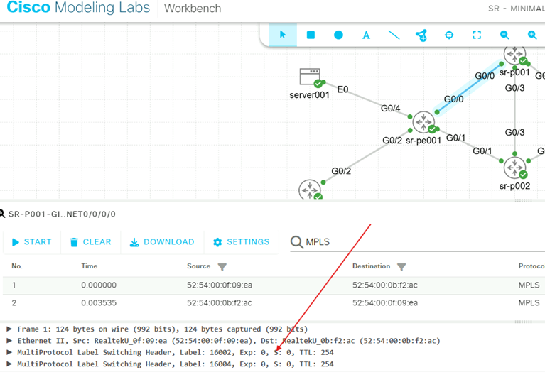
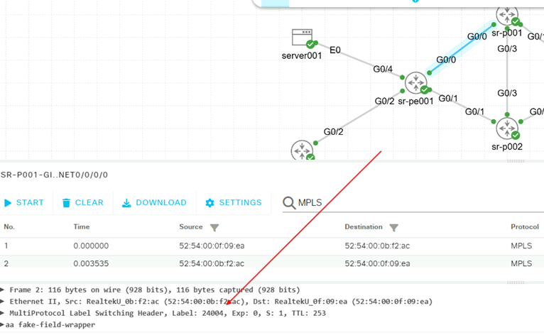

# Segment Routing Traffic Engineering 

Welcome to our Bonus Task, SR-TE!  If you have made it this far, then you have been excellent, task-driven students and wasted no time in getting to this section.  We will be configuring an explicit SID list to force packets to traverse  the link between sr-p001 and sr-p002, interface Gi0/0/0/3 on both nodes.  Normally, this link is not used because it would create an extra hop, and SR will always default to following the IGP path toward its destination.  The policy will override the IGP path.  Our policy will only affect traffic in one direction.

Creating this policy requires three steps:
1) Create the explicit SID list
2) Create the policy that will utilize the SID list
3) Steer the traffic from the EVPN into the policy
## Step 1: Configure SID-List
Recall that another term for Segment Routing is 'Source Routing'.  This is because the instructions are delivered at the source, or beginning, of the path.  Because sr-pe001 is the beginning of our EVPN circuit, we need to create an explicit SID-List on the sr-pe001 node.  This process requires you to make an indexed list of SIDs that will be used as the label stack for the packets in the service.  The hightest numbered index will be on the bottom of the stack as the routers will read the stack top-down.  We will use the SIDs of the routers sr-p001, sr-p002, and sr-pe002 to create the SID-list.

Run the following script on sr-pe001:
```bash
config
segment-routing
traffic-eng
segment-list 1to2extrahop
index 10 mpls label 16001
index 20 mpls label 16002
index 30 mpls label 16004
commit
end
```

## Step 2: Configure SR-TE policy
All policies follow the {color,endpoint} tuple identification standard.  You may create a policy with a friendly name in your configuration, but the router will identify the policy based on the tuple name, represented  as 'srte_c_<color>_ep_<endpoint>'.  We will create a policy with a friendly name then apply the policy in Step 3 using the tuple representation.

As you  may have observed, you need a color and the endpoint to uniquely identify this policy on the router.  We will use the color '5001' and keep the endpoint ip of '4.4.4.4'.

Every policy consists of at least one candidate path.  The router will calculate the validity of a candidate path and will use the valid path with the highest preference.  If a candidate path becomes invalid at any time for any reason, it wil lbe marked operationally down and the next candidate path will be used.  If there are no valid candidate paths available, the default behavior will be to use the IGP.  It is possible to force the policy to drop packets in the event there are no valid paths.

Run this script on sr-pe001:
```bash
conf
segment-routing
traffic-eng
policy my_first_SR-TE-policy
color 5001 end-point ipv4 4.4.4.4
candidate-paths
preference 100
explicit segment-list 1to2extrahop
commit
end
```

## Step 3: Steer service traffic into the policy
The last step  actually requires two tasks: create a psuedowire-class with the preferred-path marked as the SR-TE policy, and then assign the psuedowire-class to the EVPN.

Recall that the router will identify the SR-TE policy by the tuple naming standard, not the friendly name of 'my_first_SR-TE_policy'.  Discover the router's name of the policy with a show command:

```bash
show segment-routing traffic-eng policy color 5001
```
```angular2html
SR-TE policy database
---------------------

Color: 5001, End-point: 4.4.4.4
  Name: srte_c_5001_ep_4.4.4.4
  Status:
    Admin: up  Operational: up for 03:41:57 (since May  2 14:56:40.736)
  Candidate-paths:
    Preference: 100 (configuration) (active)
      Name: my_first_SR-TE_policy
      Requested BSID: dynamic
      Constraints:
        Protection Type: protected-preferred
        Maximum SID Depth: 10
      Explicit: segment-list 1to2extrahop (valid)
        Weight: 1, Metric Type: TE
          16001
          16002
          16004
  Attributes:
    Binding SID: 24007
    Forward Class: Not Configured
    Steering labeled-services disabled: no
    Steering BGP disabled: no
    IPv6 caps enable: yes
    Invalidation drop enabled: no
    Max Install Standby Candidate Paths: 0
```
The friendly name is listed under the Candidate-paths section of the output.  What we need for this Step is here:

> Color: 5001, End-point: 4.4.4.4<br>
>  Name: srte_c_5001_ep_4.4.4.4

This is the router's tuple name for the policy.

>Attributes:<br>
> Binding SID: 24007

This is the Binding SID number the router dynamically assigned to the policy.  It is possible to manually assign a Binding SID out of the local segment block.  If a Binding SID were statically assigned, it may be referenced by another policy on a remote router.

We need to use the tuple identification name the router created to steer the service traffic into the policy.

Run the following script on sr-pe001:
```bash
conf
l2vpn
 pw-class servers-te
  encapsulation mpls
   preferred-path sr-te policy srte_c_5001_ep_4.4.4.4
commit
end
```
Now that the psuedowire-class has been created, we can assign it to EVI 1001 to change the path of the servers' service:
```bash
conf
l2vpn
xconnect group servers
p2p UNTAGGED
neighbor evpn evi 1001 target 21001 source 11001
pw-class servers-te
commit
end
```
## Step 3: Verify the policy is working
Log in to server001 and ping server002, 10.10.1.2.  If the ping is working, let it continue to run.

Verify 'my_first_SR-TE_policy' is operational on sr-pe001:
```bash
show segment-routing traffic-eng policy color 5001
```
```angular2html
SR-TE policy database
---------------------

Color: 5001, End-point: 4.4.4.4
  Name: srte_c_5001_ep_4.4.4.4
  Status:
    Admin: up  Operational: up for 03:52:28 (since May  2 14:56:40.736)
  Candidate-paths:
    Preference: 100 (configuration) (active)
      Name: srte-c-5001-ep-4.4.4.4
      Requested BSID: dynamic
      Constraints:
        Protection Type: protected-preferred
        Maximum SID Depth: 10
      Explicit: segment-list 1to2extrahop (valid)
        Weight: 1, Metric Type: TE
          16001
          16002
          16004
  Attributes:
    Binding SID: 24007
    Forward Class: Not Configured
    Steering labeled-services disabled: no
    Steering BGP disabled: no
    IPv6 caps enable: yes
    Invalidation drop enabled: no
    Max Install Standby Candidate Paths: 0
```
As we can see with this line,
> Admin: up  Operational: up for 03:52:28 (since May  2 14:56:40.736)

the path is up and operational.

Return to the Edge web browser and open the lab in CML.  Righ click on the link G0/0 between sr-pe001 and sr-p001.  select Packet Capture.  In the new tab that opens in the bottom pane, click 'Start'.

You will see MPLS Switched Packets populate the capture pane.  Some of these packets may be return packets from sr-pe002.  Click on one of the packets and review the label stack.  You should see labels in the header with 16002 followed by 16004.  recall that node sr-pe001 will strip the first label, 16001, from the label stack before it forwards the packet to sr-p001 because label 16001 is the next hop from sr-pe001.



If you find a packet with a single label value in the label stack with a dynamic service label, then you have selected a return pack and you should click on another packet for review.



That's it!  Congratulations.  You've successfully built an Underlay, Overlay, two EVPN services, and an SR-TE policy.  There's much more to learn, but we hope we have created a good understanding for you, and that you have a good starting point with this lab.
